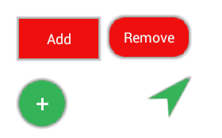
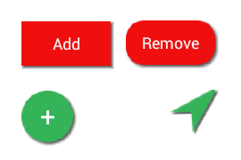
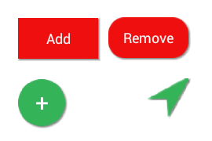
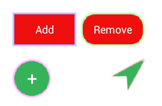

# ShadowViewDecorator
Utility for Android to create shadows.

We can use it to just pass it views and it will asynchronously get their background and draw shadow around the view. 
We can use the Shadow View Decorator's utilities methods to draw shadow on a bitmap and have it returned to us. 
We can use it to create colored shadows/glows. 
With the second approach we can add to a view a StateListDrawable for different states of the view (pressed, selected, etc.). 
 

We can add a RippleDrawable to the view: <a href="https://github.com/ektodorov/RippleDrawable-for-Android">https://github.com/ektodorov/RippleDrawable-for-Android</a>

The methods that we expect to be used most often are:
boxShadow 
boxShadowBoxBlur 
boxShadowGaussianBlur 

 

How to use:
-----------
If we want to use the Gaussian methods we need to link Renderscript library. In the build.gradle file we need to add to the defaultConfig closure

<pre>
defaultConfig {
        //some build script code ...

        renderscriptTargetApi 23
        renderscriptSupportModeEnabled true
}
</pre>

 
In an Activity in onCreate method (or after we have acquired a reference to the view we want to decorate or to it's parent view),
we post on the view's queue so that it has completed construction and layout and has it's size set.

<pre>
private RelativeLayout mRelativeLayout;
private ShadowViewDecorator mDecorator;
//button ivars mButtonRect, mButtonRectRound, etc.
...

//get reference to the view
mRelativeLayout = (RelativeLayout)findViewById(R.id.relativeLayoutMain);

//create a ShadowViewDecorator object
mDecorator = new ShadowViewDecorator(this);

//post on the views queue
mRelativeLayout.post(new Runnable() {
    @Override
    public void run() {
        //create shadow with methods of ShadowViewDecorator
        mDecorator.boxShadowBoxBlur(mButtonRect, 2, 2, 4, 0, Color.BLACK);
        mDecorator.dropShadow(mButtonRectRound, 4, 4, Color.BLACK, 20, 5, 0, 0, false, null);
        mDecorator.dropShadow(mButtonCircle, 4, 4, Color.BLACK, 20, 5, 0, 0, false, null);
        mDecorator.dropShadow(mButtonArrow, 4, 4, Color.BLACK, 20, 5, 0, 0, false, null);
        Bitmap bitmap = ShadowViewDecorator.convertToBitmap(mTextViewHorizontal.getBackground(),
            mTextViewHorizontal.getWidth(), mTextViewHorizontal.getHeight());
        Bitmap bitmapShadow = mDecorator.createShadow(bitmap, 3, 3, Color.BLACK, 30, 10, false, false, false, true);
        mTextViewHorizontal.setBackgroundDrawable(new BitmapDrawable(mResources, bitmapShadow));
    }
});
</pre>

 

Shadow 

  
Shadow offset/directional 

  

  
Shadow with color/glow 

  
Shadow only on one side 

